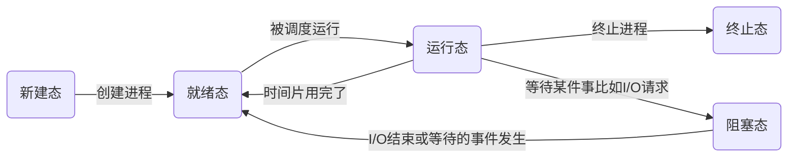
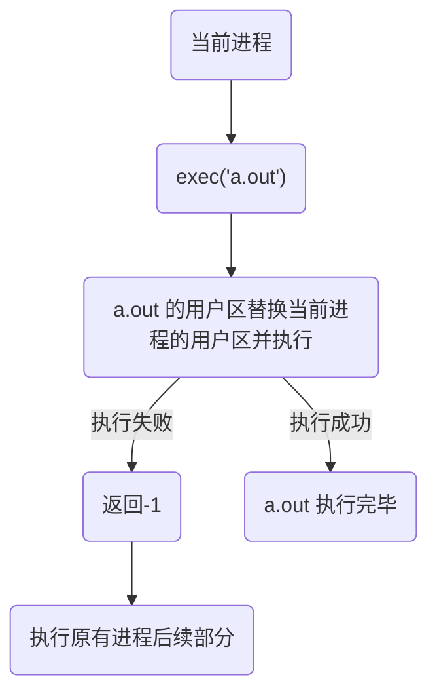
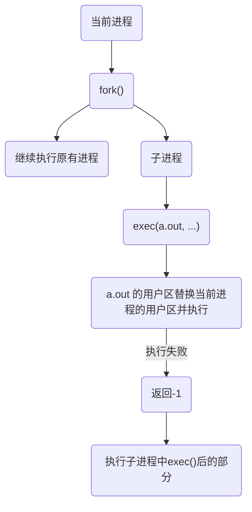

# 进程相关

[toc]

## 多进程开发

### 基础知识

- 程序

  程序是一个可执行文件，包含一系列信息，描述如何在运行时创建一个进程

  - 二进制格式标识
    - 可执行文件格式的元信息 (Linux中ELF)
  - 机器语言指令
  - 程序入口地址
  - 数据 初始化值
  - 符号表和重定位表
    - 调试
    - 运行时的符号解析（动态链接）
  - 共享库和动态链接信息
  - 其他信息

- 进程

  正在运行的程序的实例，占用内存和CPU资源，是操作系统动态执行的基本单元，是基本的分配单元，是基本的执行单元

  进程由用户内存空间（虚拟地址空间）和一系列内核数据结构组成

- 单道、多道程序

  计算机内存允许运行的程序数量

  每个进程占据一定时间片（Time Slice），Linux中通常为5-800ms

- 并行（Parallelism） / 并发（Concurrency）

  - 并行 ： 同一时刻，有多条指令在多个处理器上同时执行
    - 多处理器，多核
    - 物理上同时
  - 并发 ： 同一时刻，只能由一条指令执行，但是多个进程的指令被轮换执行，宏观上有同时执行的效果
    - 单处理器
    - 逻辑上同时

- 进程控制块（PCB）

  为了管理进程，内核需要对每个进程所做的事情进行清楚的描述。

  内核会为每个进程分配一个 PCB（又称为进程描述符表），维护进程相关的信息，Linux内核的PCB是用`task_struct`实现的

  - 进程id `pid_t`
  - 进程状态 : 就绪、运行、挂起、停止
  - 进程切换时需要保存和恢复的CPU寄存器
  - 描述虚拟地址空间的信息
  - 描述控制端的信息
  - 当前工作目录（cwd）
  - umask 掩码
  - 文件描述符表
  - 和信号相关的信息
  - uid gid
  - 会话（Session) 和 进程组 [TCP]
  - 进程可以使用的资源上限  [TCP]

### 状态

- 状态转换模型

  - 三态模型

    - 运行态
      - 进程占有处理器正在运行
    - 就绪态
      - 进程具备运行条件，等待系统分配处理器以便运行
      - 只有已经分配了除CPU之外的所有必要资源，只要获得CPU便可立即执行
      - 可能有多个就绪的进程，形成就绪队列
    - 阻塞态
      - wait / sleep 
      - 不具备运行条件，正在等待某个事件的完成
        - sleep函数
        - cin / scanf

    ```mermaid
    graph LR
    id1(运行态)--出现等待事件-->id2(阻塞态)
    id2--等待事件结束-->id3(就绪态)
    id1--时间片用完了-->id3
    id3--被调度运行-->id1
    ```

    

  - 五态模型

    - 新建态
      - 进程刚刚被创建，尚未进入就绪队列
    - *就绪态*
    - *运行态*
    - *阻塞态*
    - 终止态
      - 所有状态都能直接到终止态
      - 进入终止态的进程以后不再执行，保留在操作系统中等待善后
      - 一旦其他进程完成对终止态进程的信息抽取之后操作系统将删除该进程



- 查看进程

  ```shell
  *静态显示
  ps aux / ajx
  
  a : 显示终端上所有进程
  u : 显示进程的详细信息
  x : 显示没有控制终端的进程
  j : 列出与作业控制相关的信息
  ```

  - `aux`

    `USER        PID %CPU %MEM    VSZ   RSS TTY      STAT START   TIME COMMAND`

  - `ajx`

    `PPID    PID   PGID    SID TTY       TPGID STAT   UID   TIME COMMAND`

  STAT参数含义

  | 参数 | 含义                    |
  | ---- | ----------------------- |
  | D    | 不可中断                |
  | R    | 正在运行 / 队列中的进程 |
  | S    | 处于休眠状态            |
  | T    | 停止 / 被追踪           |
  | Z    | 僵尸进程                |
  | W    | 进入内存交换            |
  | X    | 死掉进程                |
  | <    | 高优先级                |
  | N    | 低优先级                |
  | s    | 包含子进程              |
  | +    | 位于前台的进程组        |

```shell
*实时更新
top
-d 更新间隔

排序
M 内存从大到小
P CPU
T 运行时间
U 用户名
K 输入PID杀死进程
```

```shell
*杀死进程

kill PID
kill -l 查看信号
kill -$(SIGNAL) PID 
	kill -9 PID 强制杀死PID，但无法杀死僵尸进程
killall name 通过进程名字

运行程序最后加上 & 可以后台运行，当前终端不会被阻塞
```

- 进程号
  - 进程号唯一 `pid_t` 0~32767 
  - 任何进程（除init进程外）都是由另一个进程创建（父进程），对应父进程号 PPID
  - 进程组是一个或多个进程的集合，相互关联，进程组可以接收同一终端的各种信号，关联的进程有一个进程组号（PGID）
  - 相关函数
    - `pid_t getpid(void) / pid_t getppid(void) / pid_t getpgid(pid_t pid)`

### 进程创建

**`fork()`**

```c++
#include <sys/types.h>
#include <unistd.h>

pid_t fork(void);
	创建子进程
    返回值会返回两次
        一次在父进程 	成功：返回子进程的PID 失败：返回-1
        一次在子进程	返回0
    通过返回值区分父进程和子进程
```

- 运行程序之后会生成两个进程运行

- 创建失败

  - 当前进程数已经达到系统设置上限 EAGAIN
  - 内存不足  ENOMEM

- 创建过程

  - 运行程序，生成一个虚拟地址空间，此进程就是后续的（因为还没有执行fork()）父进程
  - 执行`fork()`，子进程克隆虚拟地址空间
    - 创建初始用户区与父进程的相同
      - 后续如果分别做了不同的操作则不同
      - 栈区的pid变量的值不同
    - 内核区的 PID 不同

  *两个进程的代码完全相同，只是`fork()`的返回值不同，因此会根据返回值执行不同的代码*

- 深入

  `fork()`是通过写时拷贝（copy-on-write）技术实现的

  执行`fork()`后，内核没有复制整个进程的地址空间，父子进程共享一个地址空间

  - 只有需要写入的时候才会复制地址空间

  - 只读数据则共享地址空间

  `fork`之后父子进程**共享文件描述符表**

`**exec` 函数族**

函数名称不同，完成功能相似的一系列函数

在当前程序执行的同时执行另一个程序（表面上）

执行成功之后不会返回，调用失败返回-1



可以看出当前进程被完全替换，所以可以采用`fork()`创建子进程完成`exec()`




```c++
#include <unistd.h>

extern char **environ;

* int execl(const char *path, const char *arg, ...
          /* (char  *) NULL */);
	
	path :	需要执行的文件的路径(最好使用绝对路径)，也可以是shell命令，需要绝对路径！！
    arg	 :	可执行文件需要的参数，可以有很多
        	第一个参数一般写 执行文件的名称
        	以NULL结束
    返回 
        只有出错的时候才返回-1
	
* int execlp(const char *file, const char *arg, ...
           /* (char  *) NULL */);
	file :	会到环境变量中查找相应可执行文件，如果找到则执行，否则不执行

int execle(const char *path, const char *arg, ...
           /*, (char *) NULL, char * const envp[] */);
int execv(const char *path, char *const argv[]);
int execvp(const char *file, char *const argv[]);
int execvpe(const char *file, char *const argv[],
            char *const envp[]);

l(list) 		参数地址列表，空指针结尾
v(vector)		存有各参数地址的指针数组的地址
p(path)			按PATH环境变量指定的目录搜索可执行文件
e(enviroment)	存在环境变量字符串地址的指针数组的地址
```

### 进程控制

- **进程退出 `exit() / _exit()`**

  ```mermaid
  graph TB
  id1(进程运行) --> id2("调用退出处理函数exit()")
  id2-->id5("刷新I/O缓冲，关闭文件描述符")
  id5-->id3
  id1 --"_exit()" -->id3("调用系统_exit()")
  id3-->id4(进程终止)
  ```

  

```c++
#include <stdlib.h>
void exit(int status);

#include <unistd.h>
void _exit(int status);

	status 是进程退出时的一个状态信息。父进程回收子进程资源的时候可以获取到。
```

*`一般都是用exit(), _exit()`退出时不会刷新缓冲区，所以一些C标准的函数执行的结果不会被输出，比如printf()*

- **孤儿进程**

  *父进程结束后子进程还在运行*

  每当出现孤儿进程，内核就会把孤儿进程的父进程设置为 `init` , `init` 会循环 `wait()` 等待子进程退出以释放其资源

  孤儿进程**没有危害**，最后都会被释放

- **僵尸进程**

  *子进程结束后父进程还在运行*

  每个进程结束后，都会释放用户区数据，内核去的 PCB 没有办法自己释放掉，需要父进程去释放

  进程终止时，父进程尚未回收，自称成残留资源（PCB）存放于内核中，成为僵尸进程

  僵尸进程**不能**用 `kill -9 ` 杀死

  如果父进程不调用 `wait()` 或 `waitpid()`的话，保留的那段信息就不会被释放，进程号也会被占用，如果产生大量僵尸进程，则可能会阻止新的进程产生，**对系统有危害**，应该避免

- **进程回收 `wait() / waitpid()`**

  父进程可以通过调用`wait() / waitpid()` 得到子进程的退出状态同时彻底清除这个进程

  - `wait()` 阻塞

  - `waitpid()`可以设置非阻塞 

  一次`wait / waitpid()` 只能清理**一个**子进程

```c++
#include <sys/types.h>
#include <sys/wait.h>

pid_t wait(int *wstatus);
	等待子进程结束，如果结束则释放子进程资源
    wstatus
      	进程退出时的状态信息，传出参数
   	成功返回 pid, 
	失败 或 所有子进程都结束 则返回-1

pid_t waitpid(pid_t pid, int *wstatus, int options);
	pid : 
       < -1   回收进程组gid=|pid|的子进程
       -1     所有子进程 执行一次也只能回收一个！（最常用） 
       0      当前进程组的所有子进程	
           		默认进程组的gid就是pid
       > 0    某个子进程的pid
    options : 
		0	  	阻塞
        WNOHANG	非阻塞
            
    返回
        > 0		子进程id
       	= 0 	非阻塞情况下 还有子进程没有退出
        -1		错误 / 没有子进程
```

​	调用`wait`之后进程会被挂起，直到它的一个子进程退出或者收到一个不能忽略的信号

​	如果没有子进程，则立刻返回-1

### 进程间通信 IPC

不同进程的资源是独立的，不能在一个进程中直接访问另一个进程的资源

- **进程通信的目的**

  - 数据传输
  - 通知事件
    - 一个进程向另一个或另一组进程发送消息，通知它（它们）发生了某种事件。比如子进程终止时要通知父进程。
  - 资源共享
    - 需要内核提供互斥和同步机制
  - 进程控制
    - 有些进程希望完全控制另一个进程的执行（GDB调试），此时控制进程希望能够拦截另一个进程的所有陷入和异常，并能够及时知道它的状态改变

- **Linux 进程通信方式**

  ```mermaid
  graph LR
  	subgraph 同一主机
      id1(同一主机进程间通信)-->id2(Unix 进程间通信方式)
      id2-->id5(匿名管道)
      id2-->id6(有名管道)
      id2-->id7(信号)
  
      id1-->id3(System V 进程间通信方式)
      id1-->id4(POSIX 进程间通信方式)
  		
  	id3 ---- id13((" "))
  	id4 ---- id13
  	
  	
      id13-->id8(消息队列)
      id13-->id9(共享内存)
      id13-->id10(信号量)
      end
      
      subgraph 不同主机
      id11("不同主机（网络）进程间通信")-->id12(socket)
      end
      
  ```

### 匿名管道

是`UNIX`系统 IPC 最古老的形式，所有`UNIX`系统都支持这种通信机制

- 例子

  统计一个目录中文件的数目 `ls | wc -l` ，`|`为管道在两个进程`ls, wc -l`之间通信

  ```mermaid
  graph LR
  id1("ls | stdout(fd 1)") --"管道写入端"-->id2[["管道（字节流，单向）"]]
  id2--"管道读取端"-->id3("stdin(fd 0) | wc")
  ```

  *修改了stdout 和 stdin 的指向，原本是指向终端，现在对应管道的写入和读取端*


- 管道的特点

  - 管道是内核内存中维护的缓冲器，不同操作系统大小不一定相同

  - 管道类似文件可以读写，可以按照操作文件的方式对管道进行操作

    - 匿名管道没有文件实体（缓冲器），一般用于如父子进程（有关联）的进程之间
    - 有名管道有文件实体，但不存储数据，一般用于没有关联的进程之间

  - 一个管道是一个字节流，使用管道时不存在消息或消息边界的概念（消息是预先规定格式的字节流），从管道读取数据的进程可以读取任意大小的数据块，而不管写入进程写入管道的数据块的大小是多少

  - 通过管道传递的数据是顺序的，FIFO

    - 环形队列

  - 数据传递单向，半双工（同一时刻只能一端收一端发）

  - 从管道读数据是一次性操作，数据一旦被读走，就从管道中抛弃，释放空间一边写如若更多数据，在管道中无法使用`lseek()`来随机访问数据

  - 匿名管道只能在具有公共祖先的进程（父子进程，兄弟进程等）之间使用

    ​	因为拥有相同的文件描述符表，假设B进程是A进程的子进程，则A,B的文件描述符表指向一致fd0指向管道输入，fd1指向管道读取，于是二者可以通过fd0, fd1来进行通信

    ```mermaid
    graph LR
    	subgraph 内核空间
    	id1("fd0 | 管道缓冲区 | fd1")
    	end
    	
    	subgraph 用户空间
    	id2(进程A缓冲区)--"write()"-->id1
    	id1--"read()"-->id3(进程B缓冲区)
    	end
    ```

- `pipe()`

  ```c++
  #include <unistd.h>
  
  int pipe(int pipefd[2]);
  	创建一个匿名管道用于进程间通信
  	传出参数
  		pipefd[0] : 管道读取端
  	    pipefd[1] : 管道写入段
          
      成功返回0，否则-1
  ```

  *匿名管道只能用于具有关系的进程之间的通信*

  *管道默认是阻塞的，如果管道中没有数据，read阻塞，管道满了则write阻塞*

  - 查看管道大小 默认是 `4096 Bytes`

    - `ulimit -a`

    - `fpahtconf`

      ```c++
      #include <unistd.h>
      
      long fpathconf(int fd, int name);
      	name _PC_PIPE_BUF
      ```

      

- 管道读写特点
  - **所有**指向管道==**写**==端的文件描述符都关闭（引用计数为0），有进程从管道读取数据，剩余数据被读取以后，再次`read`会返回0
  - **存在**指向管道==**写**==端的文件描述符没有关闭（引用计数大于0），持有管道写端的也没有写入，此时从管道中读取数据，剩余数据被读取完成后，再次`read`会阻塞，直到管道中有数据可以读之后才能读取并返回
  - **所有**指向管道==**读**==端的文件描述符都关闭（引用计数为0），此时向管道写入数据，改进程会受到一个信号`SIGPIPE`，导致进程终止
  - **存在**指向管道==**读**==端的文件描述符没有关闭（引用计数大于0），持有管道读端的也没有读入，此时向管道中写如数据，再管道被写满后，再次`wirte`会阻塞，直到管道中有有空位置后才能写入并返回
  - **读管道**
    - 管道中有数据，`read`会返回读取字节数
    - 管道中无数据
      - 写端全部关闭，`read`返回0（相当于读到文件末尾）
      - 写端存在打开，`read`阻塞等待
  - **写管道**
    - 读端全部关闭，进程异常终止（`SIGPIPE`）
    - 读端存在打开
      - 管道已满，`write`阻塞等待
      - 管道未满，`write`写入数据并返回写入字节数

- 设置管道非阻塞

  ```c++
  int flags = fcntl(fd[0], F_GETFL);	// 获取文件状态
  flags |= O_NONBLOCK;
  fcntl(fd[0], F_SETFL, flags);
  
  ```


### 有名管道 FIFO

为了解决匿名管道只能用于有亲缘关系的进程间通信，提出了有名管道

以FIFO的文件形式存在于文件系统中，有文件的的实体，打开方式与打开一个普通文件是一样的

- 与 匿名管道 的区别

  - FIFO 有文件实体，文件中的内容存放于内存中（内核缓冲区）
  - 使用FIFO的进程退出之后，FIFO文件将会保存供后续使用

- `mkfifo`

  - `shell 命令 mkfifo NAME`

  - ```c++
    #include <sys/types.h>
    #include <sys/stat.h>
    
    int mkfifo(const char *pathname, mode_t mode);
    	与操作文件相同
    ```

- 注意事项（与匿名管道类似）
  - 只读打开管道会阻塞，直到另一个进程为只写打开管道
  - 只写打开管道会阻塞，直到另一个进程为只读打开管道
  - 读管道
    - 管道中有数据，`read()`返回实际字节数
    - 管道无数据
      - 写端全部关闭，`read()`返回0
      - 写端部分打开，`read()`阻塞
  - 写管道
    - 读端全部关闭，进程异常终止（`SIGPIPE`）
    - 读端部分关闭
      - 管道已满，`write()`阻塞
      - 管道未满，`write()`返回实际字节数

### 内存映射

内存映射将磁盘文件的数据映射到内存，用户通过修改内存就能修改磁盘文件。

对于一个进程来说，可以将部分文件映射到虚拟地址空间的文件的存储映射部分，对于另一个进程也可以将同样的文件部分映射到其虚拟地址空间的文件的存储映射部分，从而实现进程间通信。

- `mmap() / munmap()`

  ```c++
  #include <sys/mman.h>
  
  void *mmap(void *addr, size_t length, int prot, int flags,
             int fd, off_t offset);
  	映射一个文件的数据到内存中
      	addr	: 映射的内存首地址，一般传入NULL让内核选择地址 
          length	: 映射数据长度，不能为0，一般使用文件的长度（stat / lseek）
          prot	: 对申请映射区内存的操作权限
              		PROT_EXEC  Pages may be executed.	
              		PROT_READ  Pages may be read.
  			        PROT_WRITE Pages may be written.
  			        PROT_NONE  Pages may not be accessed.	
              	如果要操作映射区，一定要有读的权限
  		flags	: 
  				MAP_PRIVATE	映射区数据改变不会修改原有文件，会创建一个新的文件（写时拷贝）
                  MAP_SHARED	映射区数据会自动和磁盘同步（如果需要IPC则需要设置）
  		fd		: 文件描述符
              	文件大小不能为0！
              	open 指定的权限不能和 prot 冲突
  		offset	: 文件偏移，需要是4k的整数倍
              
  	成功则返回内存地址，否则返回 MAP_FAILED （void* 1)
  int munmap(void *addr, size_t length);
  	解除映射
          addr 	: 释放内存的地址
          length	: 需要释放的内存长度，与mmap的一致
  
  ```

  *可以实现任意两个进程的通信*

  *非阻塞*

- 父子进程通信

  - 创建文件

  - 在`fork()`之前创建内存映射区（保证二者的映射区一致）
  - 创建子进程
  - 父子共享内存映射区

- 没有关系进程通信

  - 准备一个大小不为0的磁盘文件

  - 进程1 通过该磁盘文件创建内存映射区，返回地址

  - 进程2 同理

- 注意事项

  - 可以操作 `mmap` 返回的指针
  - `open` 使用 `O_RDONLY`，`mmap` 中 `PROT_READ | PROT_WRITE` 会返回错误 `MAP_FAILED`
  - `offset` 不为`4K` 整数倍 会返回 `MAP_FAILED`
  - `mmap` 调用失败情况
    - `length = 0`
    - `prot`
      - 和文件不一致
  - `open` 的时候可以 用 `O_CREAT` 创建文件来创建映射区
    - 可以，注意文件大小不能为0
    - 可以通过 `lseek()` 或 `truncate()` 扩展 
  - `mmap` 后关闭文件描述符，映射区还存在，还是可以操作文件

- 内存映射还可以实现文件复制
  
- 由于操作的是内存，速度比较快
  
- **匿名映射**
  - 不需要文件实体
  - 只能做父子间的IPC
  - 使用方法
    - `flags = MAP_ANONYMOUS`

### 信号

信号是某件事件发生时对进程的通知机制，是一种软件中断，是在软件层次上对中断机制的一种模拟，是一种异步通信的方式

- 信号的产生源多半都是内核，引发内核为进程产生信号的各类事件如下：
  - 对于前台进程，用户可以通过输入特殊的终端字符来给它发送信号。（`Ctrl-C`）
  - 硬件发生异常（0作为除数）
  - 系统状态变化（`alarm` 定时器到期产生`SIGALRM`信号 / `wait`）
  - `kill` 命令或者 `kill`函数

- **信号的特点**
  - 使用简单（底层实现复杂）
  - 不能携带大量信息
  - 满足某个特定条件才能发送
  - 优先级比较高

可以使用 `kill -l` 查看系统定义的信号列表

- 前 31 个位常规信号，其余为实时信号

  ```shell
  // 常规信号
   1) SIGHUP       2) SIGINT       3) SIGQUIT      4) SIGILL       5) SIGTRAP
   6) SIGABRT      7) SIGBUS       8) SIGFPE       9) SIGKILL     10) SIGUSR1
  11) SIGSEGV     12) SIGUSR2     13) SIGPIPE     14) SIGALRM     15) SIGTERM
  16) SIGSTKFLT   17) SIGCHLD     18) SIGCONT     19) SIGSTOP     20) SIGTSTP
  21) SIGTTIN     22) SIGTTOU     23) SIGURG      24) SIGXCPU     25) SIGXFSZ
  26) SIGVTALRM   27) SIGPROF     28) SIGWINCH    29) SIGIO       30) SIGPWR
  31) SIGSYS      
  
  // 目前未使用信号
  34) SIGRTMIN    35) SIGRTMIN+1  36) SIGRTMIN+2  37) SIGRTMIN+3
  38) SIGRTMIN+4  39) SIGRTMIN+5  40) SIGRTMIN+6  41) SIGRTMIN+7  42) SIGRTMIN+8
  43) SIGRTMIN+9  44) SIGRTMIN+10 45) SIGRTMIN+11 46) SIGRTMIN+12 47) SIGRTMIN+13
  48) SIGRTMIN+14 49) SIGRTMIN+15 50) SIGRTMAX-14 51) SIGRTMAX-13 52) SIGRTMAX-12
  53) SIGRTMAX-11 54) SIGRTMAX-10 55) SIGRTMAX-9  56) SIGRTMAX-8  57) SIGRTMAX-7
  58) SIGRTMAX-6  59) SIGRTMAX-5  60) SIGRTMAX-4  61) SIGRTMAX-3  62) SIGRTMAX-2
  63) SIGRTMAX-1  64) SIGRTMAX
  ```

- 常用信号

  | 名称       | 事件                                                         | 默认动作               |
  | ---------- | ------------------------------------------------------------ | ---------------------- |
  | `SIGINT`   | 用户按下`Ctrl-C`，终端向运行中的 由该终端启动的 程序发出此信号 | 终止进程               |
  | `SIGQUIT`  | 用户按下`Ctrl-\`，终端向运行中的 由该终端启动的 程序发出此信号 | 终止进程               |
  | `SIGKILL`  | 无条件终止进程，不能被忽略，处理，阻塞                       | 终止任何进程           |
  | `SIGSEGV`  | 进程进行了无效内存访问（段错误）                             | 终止进程并产生core文件 |
  | `SIGPIPE`  | 向读端没有打开的管道写数据                                   | 终止进程               |
  | `SIGCHILD` | 子进程结束/状态改变，父进程会收到该信号                      | 忽略                   |
  | `SIGCONT`  | 进程如果停止，则是其继续运行                                 | 继续/忽略              |
  | `SIGSTOP`  | 停止进程的执行。信号不能被忽略，处理，阻塞                   | 停止进程               |

- **信号的默认处理动作**
  - `Term` 	: 终止进程
  - `Ign`       : 忽略
  - `Core`     : 终止进程，生成 Core 文件
    - 当出现 `Segment fault` 错误后，可以设置 `ulimit -c 1024` ，然后在编译时选择调试信息，在`gdb`中首先输入 `core-file core` 便可定位错误位置
  - `Stop`     : 暂停当前进程
  - `Cont`     :  继续执行当前被暂停的进程

- **信号的状态**
  - 产生
  - 未决
  - 递达

- `kill() / raise() / abort()`

  ```c++
  #include <sys/types.h>
  #include <signal.h>
  
  int kill(pid_t pid, int sig);
  	给某个进程 / 进程组 pid 发送任何信号 sig
          pid : 
   				> 0  : 进程id
                  = 0  : 当前进程组下的所有进程
                  = -1 : 发送给每个由权限接收到这个信号的进程
                  < -1 : 发送给 |pid| 的进程组
         	sig : 信号编号或宏， 0 表示不发送任何信号
  
  int raise(int sig)
      给当前进程发送信号
     
  void abort(void)
      发送 SIGABRT 信号给当前进程
  ```

- `alarm()`

  ```c++
  #include <unistd.h>
  
  unsigned int alarm(unsigned int seconds);
  	设置定时器，时间到了之后会发送 SIGALARM
      	seconds : 倒计时 时长
              	  设置为0取消
          返回  如果是第一次调用则返回0
                否则返回最近调用的剩余时长
              e.g.
               	alarm(10); 返回 0
  				过了1秒
  				alarm(5);  返回 9
  					
      SIGALARM 默认终止当前进程，每个进程只能有唯一个的定时器
      不阻塞
  ```

  程序运行的时间

  - 内核时间
  - 用户时间
  - 消耗的时间

  文件I/O操作浪费时间

  *定时器与进程状态无关，无论进程处于哪种状态都会继续*

- `setitimer()`

  可以每隔一段时间完成某项任务

  ```c++
  #include <sys/time.h>
  
  int setitimer(int which, const struct itimerval *new_value,
                struct itimerval *old_value);
  	设置定时器，可以替代 alarm，精度是微妙，可以实现周期性定时
          which 		: 定时以什么时间计时
                          ITIMER_REAL （常用） 到达时间后发送 SIGALRM
                          ITIMER_VIRTUAL 		到达时间后发送 SIGVTALRM
                          ITIMER_PROF
  		new_value 	: 设置定时器属性 （延迟多久定时，定时间隔）
  		old_value	: 上一次定时的时间参数 一般NULL
     	正常返回值
  
  		struct itimerval {
                 struct timeval it_interval; /* Interval for periodic timer */
                 struct timeval it_value;    /* Time until next expiration */ 
             };
  
  		struct timeval {
                 time_t      tv_sec;         /* seconds */
                 suseconds_t tv_usec;        /* microseconds */
             };
  ```

  

- **信号捕捉 `signal() / sigaction()`**

  ```c++
  #include <signal.h>
  
  typedef void (*sighandler_t)(int);
  
  sighandler_t signal(int signum, sighandler_t handler);
  	捕捉信号 signum 然后执行 handler
          signum	: 带捕捉的信号
          handler : 捕捉后的行为
              		SIG_IGN : 忽略
                     	SIG_DFL	: 默认
                      回调函数  : 内核自动调用
      成功则返回上一次调用的函数地址，第一次调用则NULL
      失败 返回 SIG_ERR
  ```

  *`SIGKILL / SIGSTOP`不能被捕捉，不能被忽略*
  - 信号集 `sigset_t`

    - 可以用信号集表示多个信号的集合 （可以看作集合，本质上是用位图（位运算）实现的）

    - PCB 中有 阻塞信号集（阻塞信号递达，可以设置） 和 未决信号集（无法设置）

      - 无法直接修改信号集，可以通过自定义集合借助信号集函数进行修改
      - 阻塞信号集默认不阻塞任何信号
      - 信号阻塞是暂时的

      ```mermaid
      flowchart
      id1("Ctrl-C 产生信号 SIGINT，尚未被处理，处于未决状态") --> id2(查询未决信号集对应标志位)
      id2 --> id3{标志位为0?}
      id3-->|"0，不是未决状态"| id4(处理信号)
      id3-->|"1， 是未决状态"| id5(处理之前查询阻塞信号集)
      id5-->id6{标志为0?}
      id6-->|"0, 没有阻塞"|id4
      id6-->|"1，阻塞"|id7(等待阻塞解除)
      
      ```

      ```c++
      int sigemptyset(sigset_t* set);
          清空信号集中的信号
          	set : 传出参数，需要操作的信号集
      int sigfillset(sigset_t* set); 
      	将所有信号加入信号集
              
      int sigaddset(sigset_t* set, int signum);
      	加入某一信号
      
      int sigdelset(sigset_t* set, int signum);   
      	删除某一信号
             
           以上是一般返回   
              
      int sigismember(sigset_t* set, int)
          判断某个信号是否在信号集中
          1是，0否
             
      ```

      *以上操作都是对自定义的信号集操作*

      **操作系统信号集**

      ```c++
      int sigpending(sigset_t* set);
      	获取未决信号集
              set		: 传出参数，内核数据集中的信息
      int sigprocmask(int how, const sigset* set, sigset_t* oldset);
      	获取/设置阻塞信号集
              how : 	用户信号集为 set，内核信号集为 mask
      				SIG_BLOCK    用户设置的阻塞信号集添加到内核中     mask |= set
                      SIG_UNBLOCK	 根据用户设置的数据 解除 内核中的阻塞 mask &= ~set	
                      SIG_SETMASK  用自定义信号集集替换阻塞信号集       mask = set
              set    : 用户信号集
      		oldset : 保存之前内核中的信号集，可以为NULL
           成功返回0，失败则返回-1 设置错误好 EFAULT EINVAL
                
      ```

  ```c++
  #include <signal.h>
  int sigaciton(int signum, const struct sigaction *act, strct sigaction* oldact)
      检查或改变信号的处理，信号捕捉
      	signum : 待捕捉的信号
          act	   : 捕捉后的动作
      一般返回
              
            
     	struct sigaction {
          	  	// 函数指针，信号捕捉后的处理
                 void     (*sa_handler)(int);
          		// 不常用
                 void     (*sa_sigaction)(int, siginfo_t *, void *);
          		// 临时阻塞信号集，信号捕捉函数执行过程中，临时阻塞
                 sigset_t   sa_mask;
          		// 信号的处理方式 常用 0(sa_handler) / SA_SIGINFO(sa_sigaciton)
                 int        sa_flags;
          		// 废弃
                 void     (*sa_restorer)(void);
             };
  ```
  
  *`sigaction` 是 POSIX 标准，更为通用，可以替代`signal`*
  - **信号捕捉流程**
  
    ```mermaid
    graph TB
    	subgraph User Mode
    		id0("int main() {...}") --> id1("执行主控制流程的某条指令时因为中断、异常或系统调用进入内核")
    		id4("信号处理函数返回时执行特殊的系统调用sigreturn再次进入内核")
    		id6("执行中断点后的内容")
    	end
    	subgraph Kernel Mode
    		id1-->id2("内核处理完异常准备回用户模式之前先处理当前进程中可以递送的信号")
    		id2-->|"do_signal()"|id3("如果信号的处理动作为自定义的信号处理函数，则回到用户模式执行信号处理函数（不是main()）")
    		id3-->|"void sighandler(int) {...}"| id4
    		id4-->|"sys_sigreturn()"|id5("返回用户模式从main()上次被中断的地方继续执行")
    		id5-->id6
    	end
    	
    ```
  
    

- **信号捕捉特点**
  - 在执行回调函数时，内核会使用`sa_mask`设置临时阻塞信号集，执行完后恢复内核中的阻塞信号集
  - 在执行某一个信号对应的回调函数时，其余相同信号的请求会被丢弃
    - 因为未决信号集只能记录是否未决，不能记录未决信号的个数

- **`SIGCHLD`**

  产生条件

  - 子进程终止
  - 子进程收到 `SIGSTOP` 信号停止时
  - 子进程处于停止态，收到`SIGCONT`

  父进程会收到`SIGCHLD` 信号，父进程默认忽略

  用于解决僵尸进程

  - 如果有多个子进程同时结束，产生的`SIGCHLD`会被丢弃
  - 所以还会存在一些僵尸进程

### 共享内存

**效率最高的IPC方式，不需要从磁盘复制到用户空间（内存映射），不需要从用户空间复制到内核空间（管道）**

共享内存允许两个或多个进程共享物理内存的同一块区域（段）。由于一个共享内存段会成为一个进程用户空间的一部分，因此内核介入少。需要做的时让一个进程将数据复制到共享内存中，并且这一部分数据会对其他所有共享同一个段的进程可用。

- `shmget() / shmat() / shmdt() / shmctl()`

  ```c++
  #include <sys/ipc.h>
  #include <sys/shm.h>
  int shmget(key_t key, size_t size, int shmflg);
  	创建一个新的共享内存段，或获取一个已有共享内存段的标识
      新创建的内存段中的数据都会被初始化为0
      	key 	: 通过该参数找到/创建共享内存，16进制表示，非0（0说明标记删除）
          size 	: 共享内存大小
         	shmflg	: 访问权限
              	  附加属性：创建/访问
              			创建 IPC_CREAT
              			判断是否存在 	IPC_EXCL，需要与IPC_CREAT一起使用
       成功则返回 共享内存引用ID
       失败则-1
  
  #include <sys/types.h>
  #include <sys/shm.h>
  void *shmat(int shmid, const void *shmaddr, int shmflg);
  	和当前进程关联
          shmid 	: 共享内存标识
          shmaddr : 申请的共享内存的起始地址，一般使用NULL
          shmflg	: 对共享内存操作
              读 : SHM_RDONLY，必需
              读写 : 0
      成功则返回 共享内存地址
      失败 返回 (void*) -1
                  
  int shmdt(const void* shmaddr)
      解除当前进程和共享内存的关联
    	一般返回
  
  int shmctl(int shmid, int cmd, struct shmid_d* buf)
       删除共享内存，创建共享内存的进程被消耗对共享内存无影响
       	shmid : 
  		cmd   : 操作
              IPC_STAT : 获取共享内存的状态
              IPC_SET	 : 设置共享内存的状态
              IPC_RMID : 标记共享内存被销毁
          buf	  : 共享内存的属性
              IPC_STAT : 传出参数
              IPC_SET  : 初始化数据并设置在内核中
              IPC_RMID : NULL
                  
  key_t ftok(const char* pathname, int proj_id)
       用指定路径名和 int 生成一个 key
            pathname : 一个存在且有权限访问的路径名
            proj_id  : 系统调用只会使用其中1个字节， 可以传递一个字符
  ```

- 共享内存维护了一个结构体 `struct shmid_ds`，其中的`shm_nattch`记录了关联的进程的个数

- 可以对共享内存进行多次删除，因为只是标记删除，只有关联数量为0才真正删除

  - 取消关联的进程不能继续操作内存，也不能再次关联

- 共享内存和内存映射的区别

  - 共享内存可以直接创建，内存映射需要磁盘文件（匿名映射除外）
  - 共享内存效率更高
  - 共享内存的所有关联进程操作同一块内存，内存映射每个进程在虚拟地址空间中独立存在
  - 数据安全
    - 进程突然退出，共享内存存在，内存映射区消失
    - 运行进程的电脑死机，共享内存数据消失，内存映射数据由于存在磁盘中仍存在
  - 生命周期
    - 共享内存 ，除非删除外一致存在
    - 内存映射区，进程退出销毁

### 守护进程

#### 终端

- 终端可以看作是一个设备（文件），用户通过终端登录系统后得到一个`shell`进程，这个终端成为`shell`进程的控制终端，控制终端是`shell`进程PCB中的信息，终端内启动的其他进程（包括其子进程）的控制终端也是这个终端。

- 没有做重定向的情况下每个进程的 STDIN/STDOUT/STDERR 都指向控制终端

- 控制终端输入一些特殊的控制键可以给前台进程发信号

- 后台进程（`./PROGRAMNAME &`启动）没有控制终端，无法通过终端发送信号

#### 进程组

- 进程组是一组相关进程的集合

  - 组内的所有进程有相同的`PGID`
  - 一个进程组拥有一个首进程（创建进程组的进程），`GPID` 就是首进程的 `PID`
  - 新进程会继承其父进程所属的 `PGID`
  - 有生命周期
    - 起始于 首进程创建组的时刻
    - 结束于 最后一个进程退出组（终止或加入其他进程组）的时刻

- 会话是一组相关进程组的集合

  - 会话的首进程是创建该会话的进程，`SID` 就是首进程的 `PID`
  - 一个会话中的所有进程共享单个控制终端
  - 一个终端最多可能会成为一个会话的控制终端
  - 任意时刻只有一个进程组能够成为前台进程组，能够从控制终端中读取输入

- 二者的存在是为了`shell`更好地管理进程

  

#### 守护进程

守护进程是 `Linux` 中的后台服务进程。它是一个**生存期较长**的进程*（系统启动到关闭）*，通常独立于控制终端*（内核不会为守护进程自动生成任何控制信号以及终端相关的信号）*并且周期性地执行某种任务或等待处理某些发生的事件。一般采用以 `d` 结尾的名字。

`Linux` 中的大多数服务器就是用守护进程实现的，Internet服务器 `inetd`，Web服务器 `httpd`