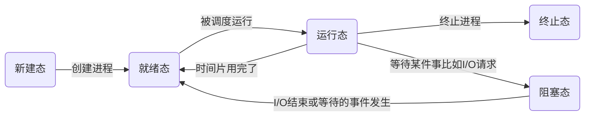
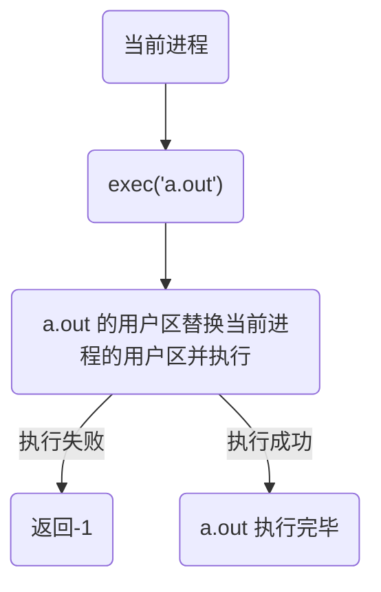
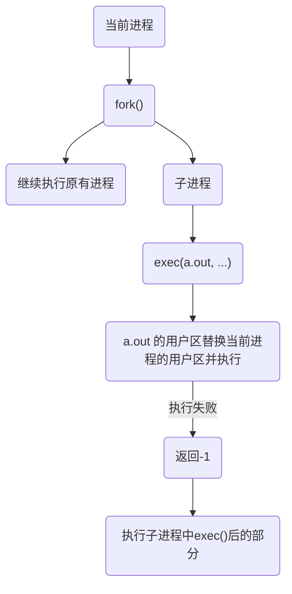

# C++ Linux下开发

[toc]

## Linux基础知识

### gcc / g++

#### gcc 和  g++ 都是 GNU（组织）的编译器

- gcc 和 g++ 都可以编译 C++ 代码
  - 编译过程中，g++会调用gcc，但是gcc命令不能**自动**和C++程序使用的库**链接**，所以需要g++来实现
  - 编译可以使用 gcc/g++，链接可以使用 g++ / gcc -lstdc++

#### GCC 常用选项

| 编译选项                                  | 说明                         |
| ----------------------------------------- | ---------------------------- |
| `-E`                                      | 预处理                       |
| `-S`                                      | 汇编                         |
| `-c`                                      | 编译                         |
| `-o [file1] [file2] / [file2] -o [file1]` | 生成可执行文件 file1         |
| `-I`                                      | 包含头文件目录               |
| `-g`                                      | 生成调试信息                 |
| `-D`                                      | 编译时指定宏                 |
| `-w`                                      | 不生成warning                |
| `-Wall`                                   | 生成所有warning              |
| `-On`                                     | 优化 n=0~3 越大级别越高      |
| `-l`                                      | 指定使用的库                 |
| `-L`                                      | 编译时搜索库的路径           |
| `-fPIC/fpic`                              | 生成与位置无关代码           |
| `-shared`                                 | 生成共享目标文件，建立共享库 |
| `-std`                                    | 指定标准                     |

```c++
// test.c
...
#ifdef DEBUG
    ...
# endif
    
    
// terminal
g++ test.c -o test     	   	// 不执行DEBUG里面的内容
g++ test.c -o test -DDEBUG  // 执行
```

### 静态库

- 优点
  - 加载速度快
  - 发布程序无需提供额外库，移植方便
- 缺点
  - 消耗系统资源，浪费内存
    - 每一个进程都会加载在内存中，会加载重复代码
  - 更新、部署、发布麻烦
    - 每次更新都要重新编译

- 命名规则 `libxxx.a`

- 生成

  1. `gcc`生成 `.o`

     ```shell
     gcc -c xxx1.c xxx2.c -I inlucde/
     ```

  2. 使用`ar` 打包 `.o`

     ```shell
     ar rcs libxxx.a xxx1.o xxx2.o
     ```

     | 参数 | 含义                 |
     | ---- | -------------------- |
     | r    | 将文件插入备存文件中 |
     | c    | 建立备存文件         |
     | s    | 建立索引             |

- 使用

  - ```shell
    .
    ├── include
    │   └── head.h
    ├── lib
    │   └── libcalc.a
    ├── main.c
    └── source
        ├── add.c
        ├── div.c
        ├── mult.c
        └── sub.c
    ```

    ```shell
    gcc main.c -o main -I ./include/ -lcalc -L ./lib/
    ```

### 动态库

- 优点
  - 进程间资源共享
  - 更新、部署、发布简单
  - 可以控制何时加载
    - 使用到才会加载
- 缺点
  - 加载速度相比于静态库较慢
  - 发布程序需要提供动态库

- 命名规则 `libxxx.so`，在Linux下是**可执行文件**

- 生成

  1. `gcc` 生成 `.o`，注意要生成与位置无关的代码

     ```shell
     gcc -c -fpic/-fPIC xxx1.c xxx2.c
     ```

  2. `gcc` 生成动态库

     ```shell
     gcc -shared xxx1.o xxx2.o -o libxxx.so
     ```

- 使用与上述静态库一致

  ```shell
  .
  ├── include
  │   └── head.h
  ├── lib
  │   └── libcalc.so
  ├── main
  ├── main.c
  └── source
      ├── add.c
      ├── div.c
      ├── mult.c
      └── sub.c
      
  gcc main.c -o main -I ./include/ -lcalc -L ./lib/
  ```

  - 运行没有问题，但是在执行 `main` 的时候报错 `./main: error while loading shared libraries: libcalc.so: cannot open shared object file: No such file or directory`，加载失败

    - 程序启动之后，在使用相应API的时候 动态库**理应**被动态加载到内存中，可以通过 `ldd（list dynamic dependencies）` 检查库的依赖关系

      ```shell
      leo@ubuntu:~/Linux/lesson05/library$ ldd main
              linux-vdso.so.1 (0x00007ffd2217a000)
              libcalc.so => not found
              libc.so.6 => /lib/x86_64-linux-gnu/libc.so.6 (0x00007f7e07907000)
              /lib64/ld-linux-x86-64.so.2 (0x00007f7e07efa000)
      ```

    - 执行程序时，需要知道 动态库 的**绝对路径**，通过系统的动态载入器来获取路径

    - 对于 elf 格式的可执行文件，通过 `ld-linux.so` 来完成，寻找顺序

      - 首先搜索 elf 文件的 `DT_RPATH`段 （无法修改）
      - 搜索环境变量 `LD_LIBRARY_PATH`
      - `/etc/ld.so.cache`
        - 将路径粘贴到`/etc/ld.so.conf`，通过`sudo ldconfig`更新
      - `/lib/,  /usr/lib` （包含许多系统自带文件，可能重复替换，不推荐）
        - 把动态库放到目录下

      

### 环境变量

- 输入`env`查看，环境变量格式`KEY = VALUE1:VALUE2:...`

- 配置环境变量

  - `export KEY=$KEY:VALUE`， `$`取原有的值，`:`增加新值 

    *只适用于当前终端*

  - 永久配置

    - 用户级别

      `/home/.bashrc`的最后以后增加上述方法

      使用`. .bashrc`或`source .bashrc`生效

    - 系统级别

      `/etc/profile`的最后增加上述方法，需要`sudo`

### Makefile

`make`是一个命令工具，可以解释`Makefile`中的指令

- Visual C++ 是 nmake
- GNU 是 make

`Makefile`用于自动化编译，可以定义编译顺序，是否需要重新编译等

#### 规则

```shell
目标 ... : 依赖 ...
	命令 （Shell）
	...
```

- 目标：最重要生成的文件
- 依赖：生成目标所需要的文件或是目标
- 命令：通过执行命令对依赖操作生成目标（必须要Tab缩进）

#### 工作原理

- 在执行命令前要检查规则中的依赖是否存在

  - 存在，执行

  - 不存在，向下检查其他规则，检查有没有其他规则能生成依赖

    找到了在执行该规则

- 检测更新，在执行规则中的命令时，比较目标和依赖文件的时间

  - 依赖时间晚于目标，则执行重新生成目标
  - 否则不执行

*Makefile的其他规则都是为第一条规则服务的，若后续规则和第一条无关则不会执行*

#### 变量

- 自定义变量 `Name = Value`
- 预定义变量
  - `AR = ar(default)`
  - `CC = cc(default)`
  - `CXX = g++(default)`
  - `$@` 目标完整名称
  - `$<` 第一个依赖文件的名称
  - `$^` 所有依赖文件 
- 获取变量值
  - `$(Name)`

#### 模式匹配

- `%`   匹配字符串， 匹配第一条规则中的依赖

  ```makefile
  %.o : %.c
  ```

#### 函数

- `$(wildcard PATTERN)`	
  - 获取指定目录下指定类型的文件列表
  - PATTERN 某个或多个目录下的对应的某种类型的文件，使用空格间隔

- `$(patsubst <pattern>, <replacement>, <text>)`
  - 查找`<text>`中符合`<pattern>`的字符串，匹配则用`<replacement>`替换

#### 定义clean

用于删除中间生成的 .o 文件

```makefile
...

.PHONY:clean
clean:
	rm $(objs) -f
```

终端中输入`make clean` 执行

*如果当前目录下存在一个文件名为 clean 的文件，那么则不会执行，因为Makefile中的clean规则没有依赖，那么目标 clean 视为永远比依赖要新的，所以不会执行， 需要增加.PHONY将其定义为伪目标*

### 文件IO

从内存的角度考虑，输入为从文件到磁盘，输出为从磁盘到文件

#### 标准C库IO


为了实现跨平台 

- Java提供虚拟机

- C会调用系统API 

C的IO速度 **高于** Linux的IO速度，C里面有缓冲区

- 缓冲区的存在使得读写磁盘的次数变少了，因此效率增加


#### 虚拟地址空间

- 存在的问题
  - 内存小无法加载多个进程
  - 进程释放后导致的内存不连续

- 系统会给每一个进程分配一个虚拟地址空间
  - 32位系统会分配$2^{32}=4 \ GB$的空间
  - 64位系统分配$2^{48} $的空间

MMU（内存管理单元）进行虚拟地址和物理地址的转换


#### 文件描述符


进程控制块可以看成一个复杂的结构体，其中包含文件描述符表，是一个数组，默认大小为1024

标准输入输出错误都指向文件 当前终端 /dev/tty（一切皆文件）

### Linux IO

查看Linux函数 `man 2 LinuxfuncitonName`， C函数 `man 3 CfunctionName`

- `open() / close()`

  ```c++
      #include <sys/types.h>  // 定义了宏
      #include <sys/stat.h>   // 定义了宏
      #include <fcntl.h>      // open 在这里面声明
      
      // 打开已经存在的文件
      int open(const char *pathname, int flags);
      	pathname	: 文件路径
      	flags		: 访问权限以及其他操作
          			  O_RDONLY, O_WRONLY, O_RDWR 互斥
          返回新的文件描述符，失败则返回-1
          
      errno 属于Linux系统函数库中的全局变量，记录最近的错误号
     	perror 属于标准C库，打印errno对应的错误描述
  
  	#include <stdio.h>
         void perror(const char *s);
        s : 用户描述
        最终输出 s:xxx(实际错误)
      
      // 创建一个文件
      int open(const char *pathname, int flags, mode_t mode);
      	flags 	: 上述参数必选而且互斥，可选参数还有O_CREAT
      	mode 	: 八进制数，表示用户对新文件的操作权限 0777 （八进制数0开头）
      			  最终权限是 mode & ~umask（root 0022）
      			  umask 用于抹去某些权限
      			  每个文件的权限用 10 个字符表示 第一个是文件类型
      			  后续总共三组依次代表 当前用户 当前用户组 其他
      			  每一位 代表 r w x
  
  ```

- `read() / write()`

  都是相对于内存而言的

  ```c++
  
  #include <unistd.h>
  
  ssize_t read(int fd, void *buf, size_t count);
  	fd		: 文件描述符
  	buf		: 从文件读取数据存放的地方
  	count	: 数组的大小
  	
  	返回 读取到的字节数量，0说明文件已经读取完毕，失败则返回-1并设置errno
  
  ssize_t write(int fd, const void *buf, size_t count);
  	buf		: 带写入数据
  	count	: 写入数据大小
  	
  	返回 写入的字节数量， 0说明没有写入内容， 失败则返回-1并设置error
  
  
  ```

- `lseek()`

  ```c++
  #include <sys/types.h>
  #include <unistd.h>
  
  off_t lseek(int fd, off_t offset, int whence);
  	offset 	: 偏移值
  	whence	: 分别相对于 起始 / 当前 / 结尾 的偏移量
  			  SEEK_SET 
                The file offset is set to offset bytes.
  
         		  SEEK_CUR 
                The file offset is set to its current location plus offset bytes.
  
  		      SEEK_END 
                The file offset is set to the size of the file plus offset bytes.
     返回 文件指针位置
  ```

  - 用法
    - 移动文件到起始
    - 获取文件指针当前位置
    - 获取文件大小
    - 拓展文件长度

- 文件属性相关 `stat() / lstat()`

  ```c++
  #include <sys/types.h>
  #include <sys/stat.h>
  #include <unistd.h>
  
  int stat(const char *pathname, struct stat *statbuf);
  	获取一个文件相关的信息
      File: text.txt
    	Size: 1453            Blocks: 8          IO Block: 4096   regular file
  	Device: 801h/2049d      Inode: 1077085     Links: 1
  	Access: (0664/-rw-rw-r--)  Uid: ( 1000/     leo)   Gid: ( 1000/     leo)
  	Access: 2022-04-19 20:11:09.587940906 +0800
  	Modify: 2022-04-19 20:36:59.151587663 +0800
  	Change: 2022-04-19 20:36:59.151587663 +0800
  	Birth: -    
          
      statbuf : 传出参数
      成功则返回 0， 否则 -1并设置errno 
              
  int lstat(const char *pathname, struct stat *statbuf);
  	可以获取 软链接 文件信息
  
  struct stat {
                 dev_t     st_dev;         /* ID of device containing file */
                 ino_t     st_ino;         /* Inode number */
                 mode_t    st_mode;        /* File type and mode */
                 nlink_t   st_nlink;       /* Number of hard links */
                 uid_t     st_uid;         /* User ID of owner */
                 gid_t     st_gid;         /* Group ID of owner */
                 dev_t     st_rdev;        /* Device ID (if special file) */
                 off_t     st_size;        /* Total size, in bytes */
                 blksize_t st_blksize;     /* Block size for filesystem I/O */
                 blkcnt_t  st_blocks;      /* Number of 512B blocks allocated */
  
                 /* Since Linux 2.6, the kernel supports nanosecond
                 precision for the following timestamp fields.
                 For the details before Linux 2.6, see NOTES. */
  
                 struct timespec st_atim;  /* Time of last access */
                 struct timespec st_mtim;  /* Time of last modification */
                 struct timespec st_ctim;  /* Time of last status change */
  
             #define st_atime st_atim.tv_sec      /* Backward compatibility */
             #define st_mtime st_mtim.tv_sec
             #define st_ctime st_ctim.tv_sec
             };
  ```

  - `mode_t`

  

- 文件权限相关 `access() / chmod() / chown() / truncate()`

  ```c++
  #include <unistd.h>
  
  int access(const char *pathname, int mode);
  
  	判断 某个文件是否有权限 或者是是否存在
  	mode : R_OK, W_OK, X_OK, F_OK 分别对应读、写、执行、存在
      成功返回0，否则-1
          
  #include <sys/stat.h>
  
  int chmod(const char *pathname, mode_t mode);
  
  	修改文件权限
          
  #include <unistd.h>
  
  int chown(const char *pathname, uid_t owner, gid_t group);
  
  	改变一个文件的所有者或者用户组
      uid,gid 的获取可以通过 /etc/passwd  /etc/group 中查看
      leo:x:1000:1000:LYs_Ubuntu18,,,:/home/leo:/bin/bash
          
      可以通过 useradd 创建用户
          
  #include <unistd.h>
  #include <sys/types.h>
  
  int truncate(const char *path, off_t length);
  
  	修改文件大小
          
      length : 修改后文件大小
  ```

- 目录操作 `mkdir() / rmdir() / rename() / chdir() / getcwd()`

  ```c++
  #include <sys/stat.h>
  #include <sys/types.h>
  
  int mkdir(const char *pathname, mode_t mode);
  
  
  #include <unistd.h>
  
  int rmdir(const char *pathname);
  	只能删除空目标
  
  
  #include <stdio.h>
  
  int rename(const char *oldpath, const char *newpath);
  
  
  #include <unistd.h>
  
  int chdir(const char *path);
  	修改进程工作目录
   
  #include <unistd.h>
  
  char *getcwd(char *buf, size_t size);        
  	获取当前目录
      buf  : 路径字符串
      size : buf大小
      返回 buf 的地址， 实际上是一样的
  ```

- 目录遍历 `opendir() / readdir() / closedir()`

  ```c++
  #include <sys/types.h>
  #include <dirent.h>
  
  DIR *opendir(const char *name);
  	打开目录，返回目录流DIR
      失败则返回 NULL
          
  #include <dirent.h>
  
  struct dirent *readdir(DIR *dirp);
  	读取目录
      struct dirent 是读取到的信息
          struct dirent {
              ino_t          d_ino;       /* Inode number */
              off_t          d_off;       /* Not an offset; see below */
              unsigned short d_reclen;    /* Length of this record */
              unsigned char  d_type;      /* Type of file; not supported
                                                by all filesystem types */
              /*
             	  DT_BLK      This is a block device.
                DT_CHR      This is a character device.
                DT_DIR      This is a directory.
                DT_FIFO     This is a named pipe (FIFO).
                DT_LNK      This is a symbolic link.
                DT_REG      This is a regular file.
                DT_SOCK     This is a UNIX domain socket.
                DT_UNKNOWN  The file type could not be determined. */
                  
              char           d_name[256]; /* Null-terminated filename */
          };
          
  #include <sys/types.h>
  #include <dirent.h>
  
  int closedir(DIR *dirp);
  	关闭目录，
  ```

- 文件描述符相关 `dup() / dup2() `

  ```c++
  #include <unistd.h>
  
  int dup(int oldfd);
  	拷贝文件描述符，指向同一个文件，返回新的文件描述符
  	失败则返回-1
  #include <unistd.h>
  
  int dup2(int oldfd, int newfd);
  	重定向文件描述符，使得newfd指向和oldfd相同的文件
      oldfd必须有效
      会自动关闭newfd指向的文件
  ```

- `fcntl`

  复制文件描述符

  设置/获取文件的状态标志

  ```c++
  #include <unistd.h>
  #include <fcntl.h>
  
  int fcntl(int fd, int cmd, ... /* arg */ );
  	cmd :
  		F_DUPFD 复制文件描述符
  		F_SETFL 打开一个文件之后可以修改文件的读写操作
  ```

  

## 多进程开发

### 基础知识

- 程序

  程序是一个可执行文件，包含一系列信息，描述如何在运行时创建一个进程

  - 二进制格式标识
    - 可执行文件格式的元信息 (Linux中ELF)
  - 机器语言指令
  - 程序入口地址
  - 数据 初始化值
  - 符号表和重定位表
    - 调试
    - 运行时的符号解析（动态链接）
  - 共享库和动态链接信息
  - 其他信息

- 进程

  正在运行的程序的实例，占用内存和CPU资源，是操作系统动态执行的基本单元，是基本的分配单元，是基本的执行单元

  进程由用户内存空间（虚拟地址空间）和一系列内核数据结构组成

- 单道、多道程序

  计算机内存允许运行的程序数量

  每个进程占据一定时间片（Time Slice），Linux中通常为5-800ms

- 并行（Parallelism） / 并发（Concurrency）
  - 并行 ： 同一时刻，有多条指令在多个处理器上同时执行
    - 多处理器，多核
    - 物理上同时
  - 并发 ： 同一时刻，只能由一条指令执行，但是多个进程的指令被轮换执行，宏观上有同时执行的效果
    - 单处理器
    - 逻辑上同时

- 进程控制块（PCB）

  为了管理进程，内核需要对每个进程所做的事情进行清楚的描述。

  内核会为每个进程分配一个 PCB（又称为进程描述符表），维护进程相关的信息，Linux内核的PCB是用`task_struct`实现的

  - 进程id `pid_t`
  - 进程状态 : 就绪、运行、挂起、停止
  - 进程切换时需要保存和恢复的CPU寄存器
  - 描述虚拟地址空间的信息
  - 描述控制端的信息
  - 当前工作目录（cwd）
  - umask 掩码
  - 文件描述符表
  - 和信号相关的信息
  - uid gid
  - 会话（Session) 和 进程组 [TCP]
  - 进程可以使用的资源上限  [TCP]

### 进程

#### 状态

- 状态转换模型

  - 三态模型

    - 就绪态
      - 进程占有处理器正在运行
    - 运行态
      - 进程具备运行条件，等待系统分配处理器以便运行
      - 只有已经分配了除CPU之外的所有必要资源，只要获得CPU便可立即执行
      - 可能有多个就绪的进程，形成就绪队列
    - 阻塞态
      - wait / sleep 
      - 不具备运行条件，正在等待某个事件的完成
        - sleep函数
        - cin / scanf

    ```mermaid
    graph LR
    id1(运行态)--出现等待事件-->id2(阻塞态)
    id2--等待事件结束-->id3(就绪态)
    id1--时间片用完了-->id3
    id3--被调度运行-->id1
    ```

    

  - 五态模型

    - 新建态
      - 进程刚刚被创建，尚未进入就绪队列
    - *就绪态*
    - *运行态*
    - *阻塞态*
    - 终止态
      - 所有状态都能直接到终止态
      - 进入终止态的进程以后不再执行，保留在操作系统中等待善后
      - 一旦其他进程完成对终止态进程的信息抽取之后操作系统将删除该进程



- 查看进程

  ```shell
  *静态显示
  ps aux / ajx
  
  a : 显示终端上所有进程
  u : 显示进程的详细信息
  x : 显示没有控制终端的进程
  j : 列出与作业控制相关的信息
  ```

  - `aux`

    `USER        PID %CPU %MEM    VSZ   RSS TTY      STAT START   TIME COMMAND`

  - `ajx`

    `PPID    PID   PGID    SID TTY       TPGID STAT   UID   TIME COMMAND`

  STAT参数含义

  | 参数 | 含义                    |
  | ---- | ----------------------- |
  | D    | 不可中断                |
  | R    | 正在运行 / 队列中的进程 |
  | S    | 处于休眠状态            |
  | T    | 停止 / 被追踪           |
  | Z    | 僵尸进程                |
  | W    | 进入内存交换            |
  | X    | 死掉进程                |
  | <    | 高优先级                |
  | N    | 低优先级                |
  | s    | 包含子进程              |
  | +    | 位于前台的进程组        |

```shell
*实时更新
top
-d 更新间隔

排序
M 内存从大到小
P CPU
T 运行时间
U 用户名
K 输入PID杀死进程
```

```shell
*杀死进程

kill PID
kill -l 查看信号
kill -$(SIGNAL) PID 
	kill -9 PID 强制杀死PID
killall name 通过进程名字

运行程序最后加上 & 可以后台运行，当前终端不会被阻塞
```

- 进程号
  - 进程号唯一 `pid_t` 0~32767 
  - 任何进程（除init进程外）都是由另一个进程创建（父进程），对应父进程号 PPID
  - 进程组是一个或多个进程的集合，相互关联，进程组可以接收同一终端的各种信号，关联的进程有一个进程组号（PGID）
  - 相关函数
    - `pid_t getpid(void) / pid_t getppid(void) / pid_t getpgid(pid_t pid)`

#### 进程创建

`fork()`

```c++
#include <sys/types.h>
#include <unistd.h>

pid_t fork(void);
	创建子进程
    返回值会返回两次
        一次在父进程 	成功：返回子进程的PID 失败：返回-1
        一次在子进程	返回0
    通过返回值区分父进程和子进程
```

- 运行程序之后会生成两个进程运行
- 创建失败
  - 当前进程数已经达到系统设置上限 EAGAIN
  - 内存不足  ENOMEM

- 创建过程

  - 运行程序，生成一个虚拟地址空间，此进程就是后续的（因为还没有执行fork()）父进程
  - 执行`fork()`，子进程克隆虚拟地址空间
    - 创建初始用户区与父进程的相同
      - 后续如果分别做了不同的操作则不同
      - 栈区的pid变量的值不同
    - 内核区的 PID 不同

  *两个进程的代码完全相同，只是`fork()`的返回值不同，因此会根据返回值执行不同的代码*

- 深入

  `fork()`是通过写时拷贝（copy-on-write）技术实现的

  执行`fork()`后，内核没有复制整个进程的地址空间，父子进程共享一个地址空间

  - 只有需要写入的时候才会复制地址空间

  - 只读数据则共享地址空间

  `fork`之后父子进程共享文件

#### exec 函数族

函数名称不同，完成功能相似的一系列函数

在当前程序执行的同时执行另一个程序（表面上）

执行成功之后不会返回，调用失败返回-1



可以看出当前进程被完全替换，所以可以采用`fork()`创建子进程完成`exec()`




```c++
#include <unistd.h>

extern char **environ;

* int execl(const char *path, const char *arg, ...
          /* (char  *) NULL */);
	
	path :	需要执行的文件的路径(最好使用绝对路径)，也可以是shell命令，需要绝对路径！！
    arg	 :	可执行文件需要的参数，可以有很多
        	第一个参数一般写 执行文件的名称
        	以NULL结束
    返回 
        只有出错的时候才返回-1
	
* int execlp(const char *file, const char *arg, ...
           /* (char  *) NULL */);
	file :	会到环境变量中查找相应可执行文件，如果找到则执行，否则不执行

int execle(const char *path, const char *arg, ...
           /*, (char *) NULL, char * const envp[] */);
int execv(const char *path, char *const argv[]);
int execvp(const char *file, char *const argv[]);
int execvpe(const char *file, char *const argv[],
            char *const envp[]);

l(list) 		参数地址列表，空指针结尾
v(vector)		存有各参数地址的指针数组的地址
p(path)			按PATH环境变量指定的目录搜索可执行文件
e(enviroment)	存在环境变量字符串地址的指针数组的地址
```

